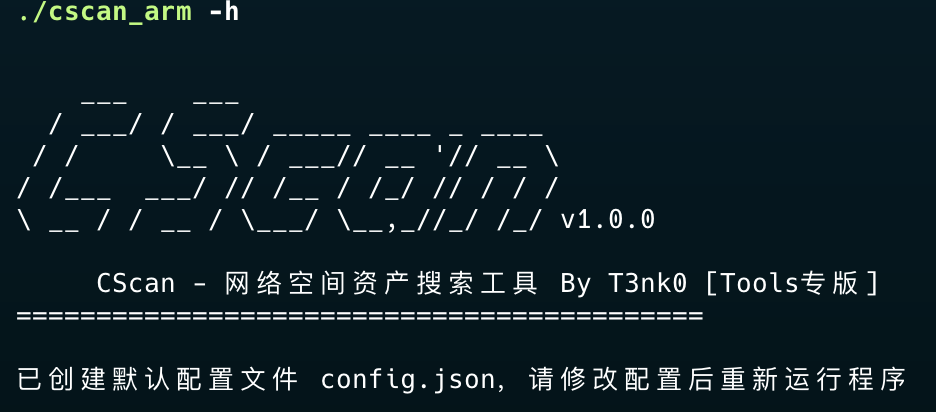
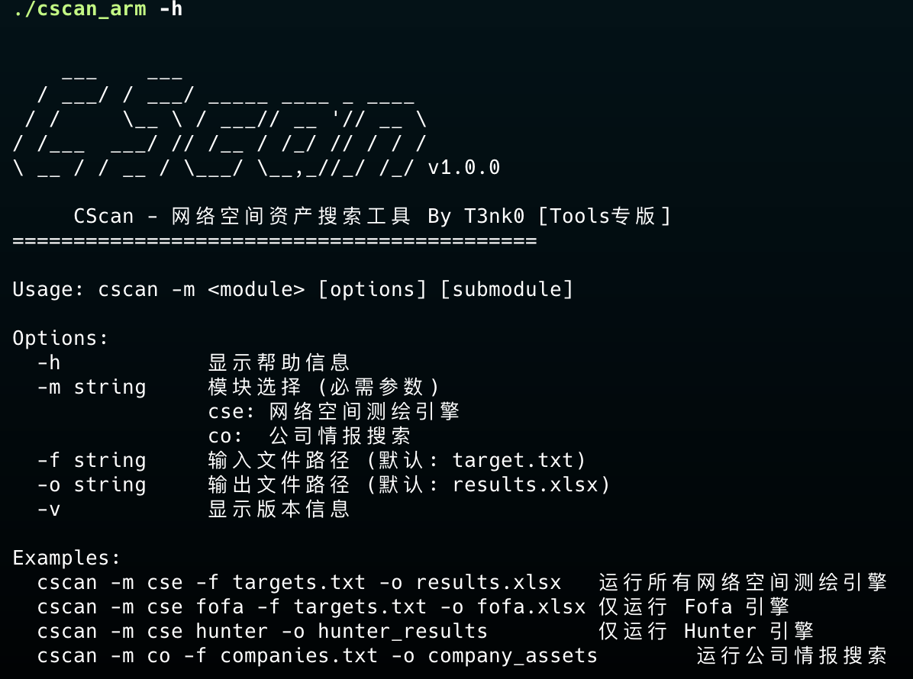
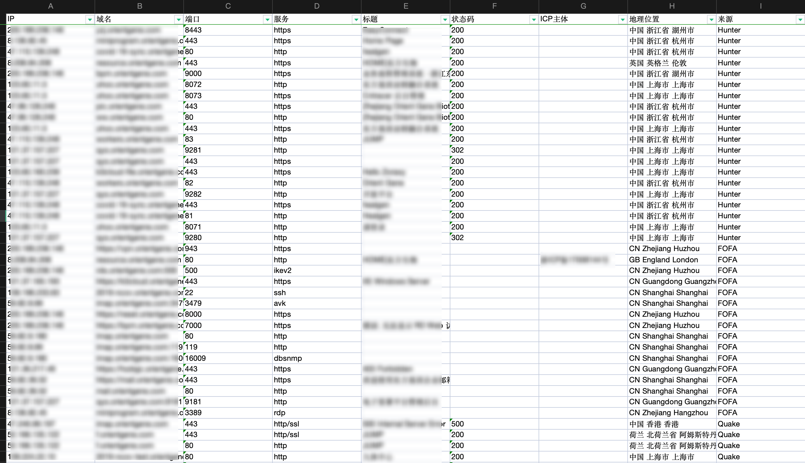

# CScan - 网络空间资产搜索工具

CScan 是一个基于Go语言开发的网络空间资产搜索工具，支持多个主流网络空间搜索引擎，能够快速搜索IP、域名等资产信息。

## 项目背景

在信息收集的时候，经常需要处理大量IP地址、域名和企业名称等资产信息。传统的手动资产搜集方式效率低下且容易出错。CScan旨在通过自动化工具调用各大网络空间搜索引擎的API接口，快速完成资产搜集工作，显著提升工作效率。

主要解决以下痛点：
- 手动搜集资产耗时耗力
- 多个平台API调用繁琐
- 结果格式不统一
- 缺乏统一的速率控制和错误处理机制

## 功能特性

- **多引擎支持**：集成Hunter、FOFA、Quake、Zone等多个网络空间搜索引擎
- **资产类型**：支持IP、域名两种目标类型
- **批量搜索**：支持批量处理目标列表
- **结果导出**：自动将搜索结果导出为Excel文件
- **速率控制**：内置API调用速率限制，防止触发平台限制
- **错误处理**：自动处理API错误，支持指数退避重试

## 安装说明

### 方式一：使用预编译二进制文件

1. 访问 [Releases](https://github.com/T3nk0/cscan/releases) 页面
2. 根据系统架构下载对应版本：
   - Windows: cscan_windows_amd64.zip
   - Linux: cscan_linux_amd64.tar.gz
   - macOS: cscan_darwin_amd64.tar.gz
3. 解压下载的文件
4. 运行二进制文件

### 方式二：从源码编译

1. 确保已安装Go 1.18+环境
2. 克隆项目：
   ```bash
   git clone https://github.com/T3nk0/cscan.git
   cd cscan
   ```
3. 安装依赖：
   ```bash
   go mod tidy
   ```
4. 编译项目：
   ```bash
   go build -o cscan cmd/main.go
   ```

## 使用效果







## 使用说明

### 基本用法

```bash
./cscan -m <module> [options] [submodule]
```

### 参数说明

| 参数 | 说明 |
|------|------|
| -m   | 模块选择 (cse/co) |
| -f   | 输入文件路径 (默认: target.txt) |
| -o   | 输出文件路径 (默认: results.xlsx) |
| -v   | 显示版本信息 |

### 模块说明

#### 网络空间测绘 (cse)

```bash
# 使用所有引擎搜索
./cscan -m cse -f targets.txt -o results.xlsx

# 使用指定引擎搜索
./cscan -m cse hunter -f targets.txt -o hunter_results.xlsx
```

支持子模块：
- hunter: Hunter引擎
- fofa: FOFA引擎
- quake: Quake引擎

#### 公司情报 (co)

```bash
./cscan -m co -f companies.txt -o company_assets.xlsx
```

支持子模块：
- zone: Zone引擎

## 配置说明

首次运行程序时，如果当前目录下不存在 `config.json` 文件，程序会自动创建配置文件模板。

配置文件 `config.json` 需要包含以下内容：

```json
{
  "hunter_api_key": "your-hunter-key",
  "fofa_email": "your-fofa-email",
  "fofa_api_key": "your-fofa-key",
  "quake_api_key": "your-quake-key",
  "zone_api_key": "your-zone-key",
  "max_page": 10,
  "page_size": 100
}
```

## 示例

### 搜索IP资产

1. 创建目标文件 `targets.txt`：
   ```
   192.168.1.1
   8.8.8.8
   ```

2. 执行搜索：
   ```bash
   ./cscan -m cse -f targets.txt -o ip_results.xlsx
   ```

### 搜索公司资产

1. 创建公司列表文件 `companies.txt`：
   ```
   阿里巴巴
   腾讯
   ```

2. 执行搜索：
   ```bash
   ./cscan -m co -f companies.txt -o company_assets.xlsx
   ```

## 注意事项

1. 请确保已获取各平台的API Key并正确配置
2. 建议控制目标数量，避免触发平台限制
3. 输出文件为Excel格式，建议使用Excel或WPS打开
4. 程序内置了API调用间隔，请勿手动调整
